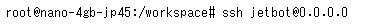

# JetBot Software Setup
- Video Instruction: https://youtu.be/6I9ZT5NKmsA
- Official Instruction: https://jetbot.org/master/software_setup/sd_card.html
- You need a PC, an HDMI display and a USB keyboard to setup.
- We recommend you to follow the instruction below it includes some updates that are not included above.

## 1. Flash JetBot SD Card Image
1. Download JetBot SD card image for Jetson Nano 4GB ```jetbot-043_nano-4gb-jp45.zip``` from [here](https://jetbot.org/master/software_setup/sd_card.html).

    

3. Download balenaEtcher from [here](https://www.balena.io/etcher/) and install it to your PC.

        

4. Instert an empty micro SD card into your PC.
5. Flash the JetBot SD card image ```jetbot-043_nano-4gb-jp45.zip``` onto the micro SD card using balenaEtcher.
    
    

## 2. First Boot and WiFi Setup
1. Insert the micro SD card into the JetBot.

    

2. Plug an HDMI display and a USB keyboard to the JetBot.
3. Turn on the JetBot power switch to boot.

    

4. Login with the username ```jetbot``` and the password ```jetbot```.

    

5. Check available WiFi by the command ```sudo nmcli device wifi list``` with the password ```jetbot```.

    

6. Connect to one of the available WiFi by the command ```sudo nmcli device wifi connect <WiFi_SSID> password <WiFi_PASSWORD>```

    

7. Shutdown the JetBot by the command ```sudo shutdown now```.
8. Turn off the JetBot power switch.
9. Unplug the HDMI display and the USB keyboard from the JetBot. From next time, you don't need the display and the keyboard anymore.

## 3. Remote Access and Additional Setups
### Access to the JetBot via Web Browser
1. Boot the JetBot. Wait for the JetBot to be connected to the WiFi automatically.
2. Check the IP address shown on the JetBot display.

    

3. Make sure your computer is connected to the same WiFi with your JetBot.
4. Open a web browser and access to ```http://<JETBOT_IP_ADDRESS>:8888```, e.g. ```http://192.168.11.11:8888```.

    

5. Login to the JetBot with the password ```jetbot```.

    

### Install SSH and Reconfigure Partition
1. Open the Terminal from the Launcher.

    

2. Update APT by the command ```apt update```.

    

3. Install SSH by the command ```apt install ssh -y```.

    


4. Login via SSH by the command ```ssh jetbot@0.0.0.0``` then type ```yes``` and password ```jetbot```.

    

5. Reconfigure the partition by the commands,
    ```
    cd jetcard
    git pull
    ./scripts/jetson_install_nvresizefs_service.sh
    ```
1. Shutdown the JetBot by the command ```sudo shutdown now```.

1. Boot the JetBot again. Now you have more free space in your disk.

    

## 4. Regular Shutdown
After finishing above setups, you can shutdown your JetBot from the terminal via the web browser.
1. If needed, open a terminal from the Launcher.
1. Login via SSH by the command ```ssh jetbot@0.0.0.0``` then type ```yes``` and password ```jetbot```.
2. Shutdown the JetBot by the command ```sudo shutdown now``` with the password ```jetbot```.
